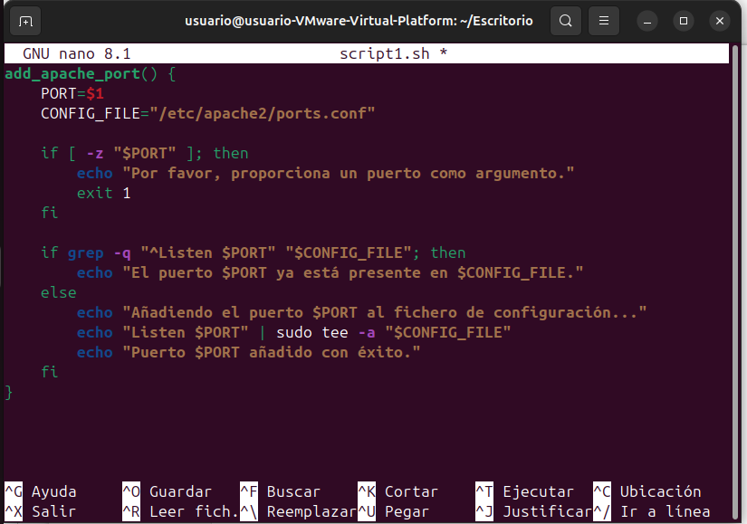

# Crea un script para cada uno de los siguientes problemas en ubuntu:
 
## Crea un script que añada un puerto de escucha en el fichero de configuración de Apache. El puerto se recibirá como parámetro en la llamada y se comprobará que no esté ya presente en el fichero de configuración.

1. Creamos el script:

`nano script1.php`.

 

2. Copiamos el contenido del script

```bash
add_apache_port() {
    PORT=$1
    CONFIG_FILE="/etc/apache2/ports.conf"

    if [ -z "$PORT" ]; then
        echo "Por favor, proporciona un puerto como argumento."
        exit 1
    fi

    if grep -q "^Listen $PORT" "$CONFIG_FILE"; then
        echo "El puerto $PORT ya está presente en $CONFIG_FILE."
    else
        echo "Añadiendo el puerto $PORT al fichero de configuración..."
        echo "Listen $PORT" | sudo tee -a "$CONFIG_FILE"
        echo "Puerto $PORT añadido con éxito."
    fi
}
```

 

 Guardamos y Salimos

 Damos permisos de ejecución

 `chmod +x script.sh`

 Si quisieramos probar el script

 `sudo ./script.sh add_apache_port 8080`


## Crea un script que añada un nombre de dominio y una ip al fichero hosts. Debemos comprobar que no existe dicho dominio en el fichero hosts

Lo mismo que lo de antes para crear el script, lo llamariamos script2 y le damos el siguiente contenido

```bash
add_host_entry() {
    DOMAIN=$1
    IP=$2
    HOSTS_FILE="/etc/hosts"

    if [ -z "$DOMAIN" ] || [ -z "$IP" ]; then
        echo "Uso: $0 <dominio> <ip>"
        exit 1
    fi

    if grep -q "$DOMAIN" "$HOSTS_FILE"; then
        echo "El dominio $DOMAIN ya está presente en $HOSTS_FILE."
    else
        echo "Añadiendo $DOMAIN con IP $IP al fichero $HOSTS_FILE..."
        echo "$IP $DOMAIN" | sudo tee -a "$HOSTS_FILE"
        echo "Dominio $DOMAIN añadido con éxito."
    fi
}
```

Crea un script que nos permita crear una página web con un título, una cabecera y un mensaje

```bash
create_web_page() {
    TITLE=$1
    HEADER=$2
    MESSAGE=$3
    OUTPUT_FILE="/var/www/html/custom_page.html"

    if [ -z "$TITLE" ] || [ -z "$HEADER" ] || [ -z "$MESSAGE" ]; then
        echo "Uso: $0 <titulo> <cabecera> <mensaje>"
        exit 1
    fi

    echo "Creando página web..."
    sudo bash -c "cat > $OUTPUT_FILE <<EOL
<!DOCTYPE html>
<html>
<head>
    <title>$TITLE</title>
</head>
<body>
    <h1>$HEADER</h1>
    <p>$MESSAGE</p>
</body>
</html>
EOL"
    echo "Página web creada en $OUTPUT_FILE."
}

# Main script to choose functionality
if [ "$1" == "add_apache_port" ]; then
    add_apache_port "$2"
elif [ "$1" == "add_host_entry" ]; then
    add_host_entry "$2" "$3"
elif [ "$1" == "create_web_page" ]; then
    create_web_page "$2" "$3" "$4"
else
    echo "Uso: $0 <add_apache_port|add_host_entry|create_web_page> [argumentos...]"
    exit 1
fi
```
